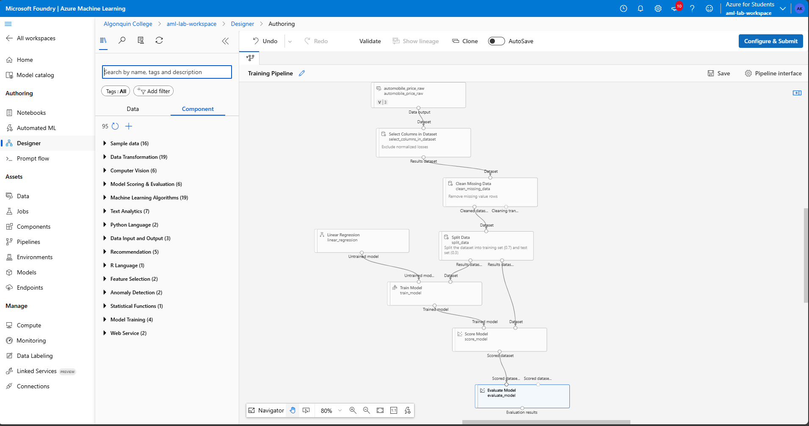
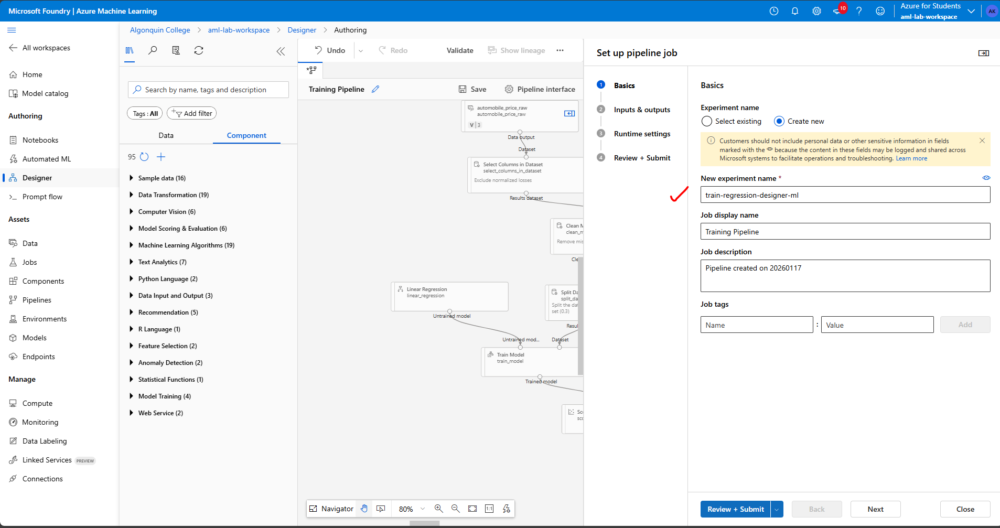
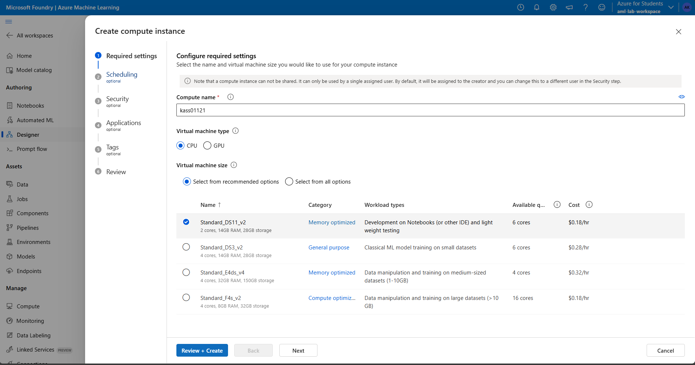
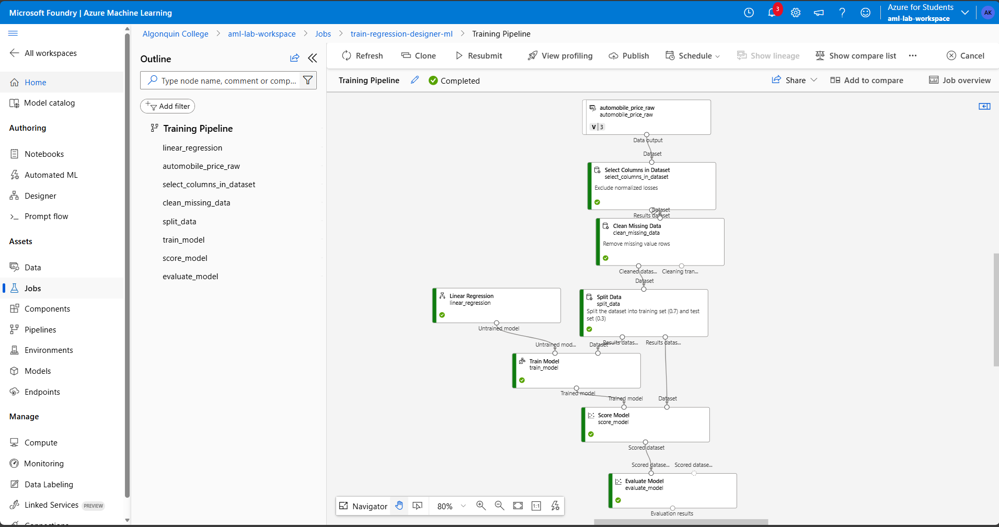
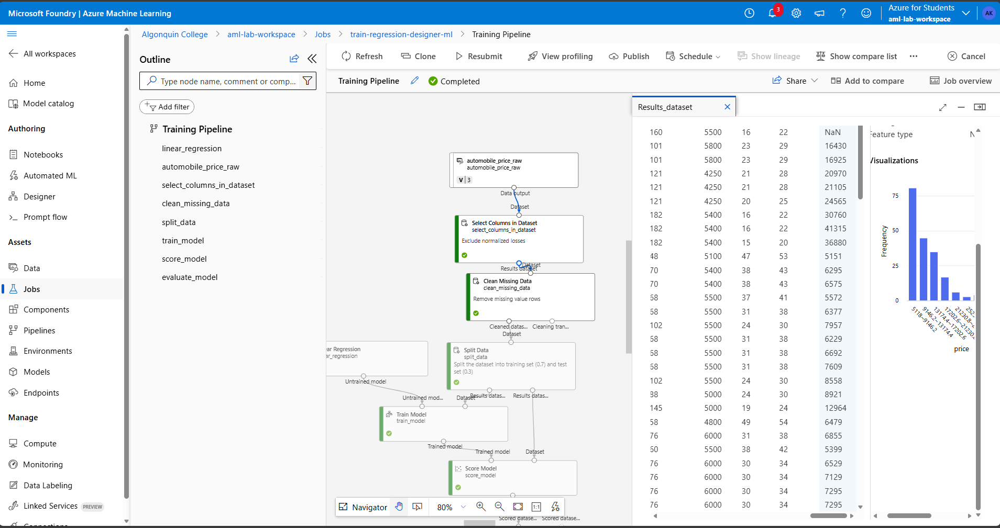
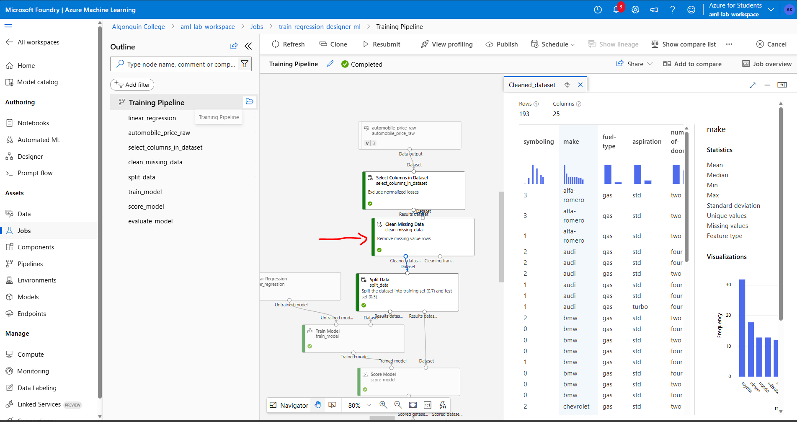
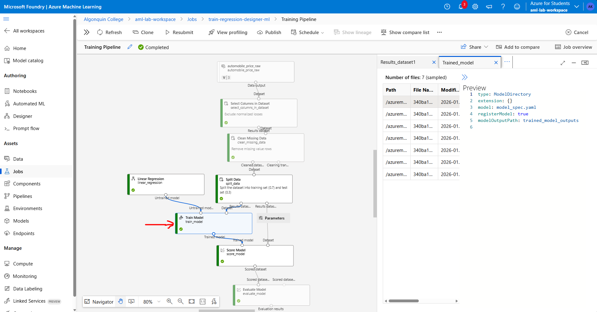
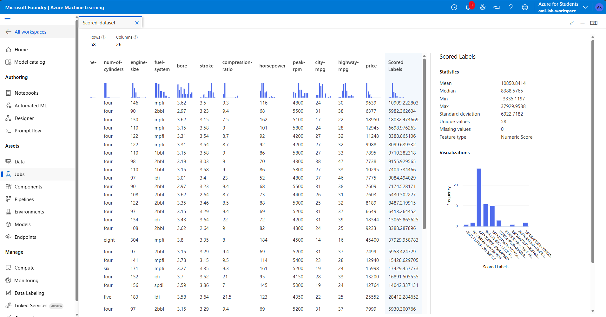

# About me 
### Full name: Anani Thierry Kassa
### Student ID: 041140713

1.	Create an Azure Machine Learning workspace in the Canada Central region. Once created, become familiar with the interface, including how to access designer as well as create and attach compute to work with a pipeline.

2.	Explore the Azure Machine Learning studio which is a web-based portal that can be accessed through azure machine learning workspace.
- Authoring section, 
- Assets section, 
- Note the Manage section

3.	Create a training pipeline – Train the model using designer

4.	Select the Regression - Automobile Price Prediction (Basic) sample 

5.	Select Configure & Submit (5-6 share the same screenshot)
6.	Create new experiment and set the name as train-regression-designer-ml

7.	On the Inputs & outputs page select Next without making any changes

8.	On the Runtime settings page an error appears as you don´t a default compute to run the pipeline, to avoid this error create a compute instance target

9.	Create a new azure ml compute instance – select Standard_DS11_v2 from the recommended option.

10.	Create and wait for the instance to start until it’s running.(10-11 share the same screenshot)
11.	Execute your training pipeline

12.	Use jobs tab to review your workload and see the status of the pipeline if it has executed successfully or failed.

13.	When the job is completed, view the details of each individual component run, including the output. Explore the pipeline to understand how the model is trained.

14.	Delete all the resources created in the lab.

