# About me 
### Full name: Anani Thierry Kassa
### Student ID: 041140713

# Lab Activity Overview:
### Step 1: Upload Data to Azure Data Lake 
1.	Sign in to the Azure Portal
2.	Navigate to your Storage Account
3.	Open Containers
4.	Create a container named: raw
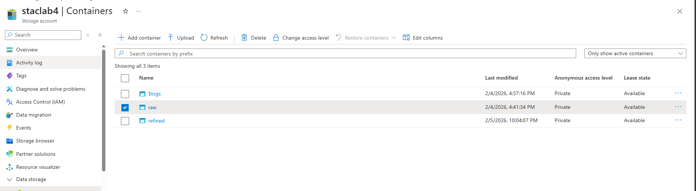
5.	Upload the provided sample dataset in weekly lab 4 files into
•	raw/customers/customers.parquet
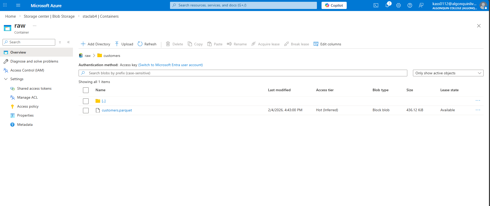
•	raw/orders/orders.parquet

•	raw/order_events/order_events.parquet

### Step 2: Explore Data using Serverless SQL
1.	Open Azure Synapse Studio
2.	Navigate to Develop → SQL script
3.	Run the following query to explore Parquet files directly from the Data Lake:
SELECT TOP 100 * FROM OPENROWSET( BULK 'https://<storage-account>.dfs.core.windows.net/raw/*.parquet', FORMAT = 'PARQUET ) AS rows;
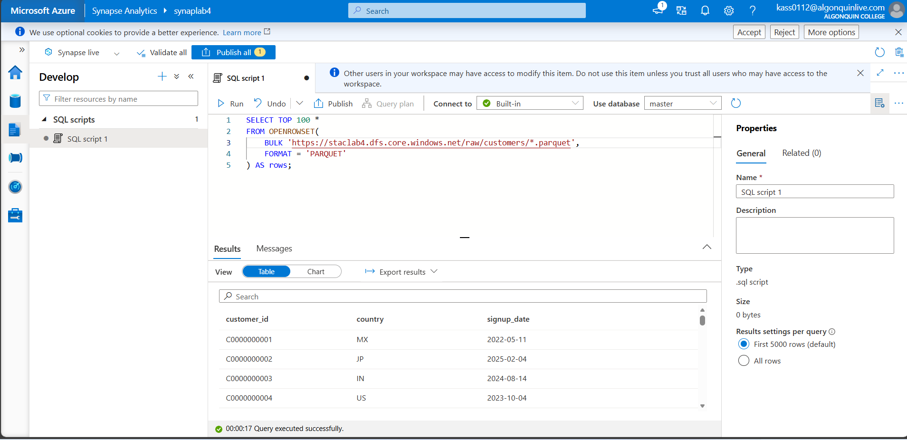
4.	Observe: Column names, Data types, Sample records
5.	Try adding a filter: WHERE Year > 2022
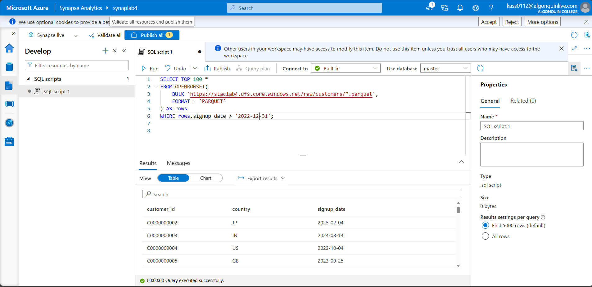

### Step 3: Explore Data using Spark Notebook
1.	In Synapse Studio, go to Develop → Notebooks
2.	Create a new Spark Notebook
3.	Select Python as the language
4.	Load the data: 
df = spark.read.parquet( "abfss://raw@<storage-account>.dfs.core.windows.net/*.parquet”)
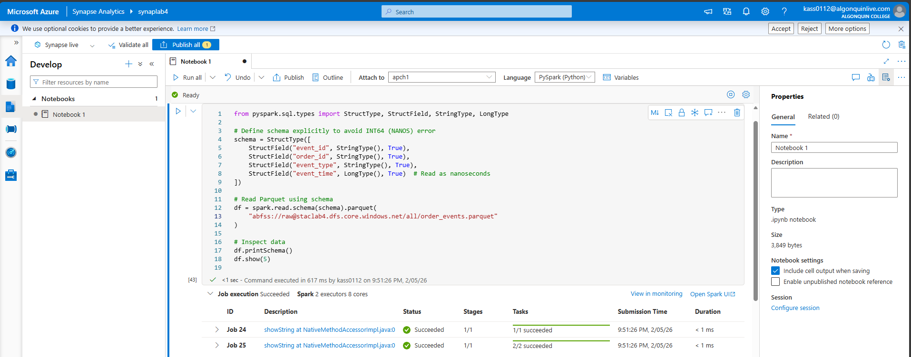
5.	Inspect the data: 
df.printSchema() 
df.show(5)
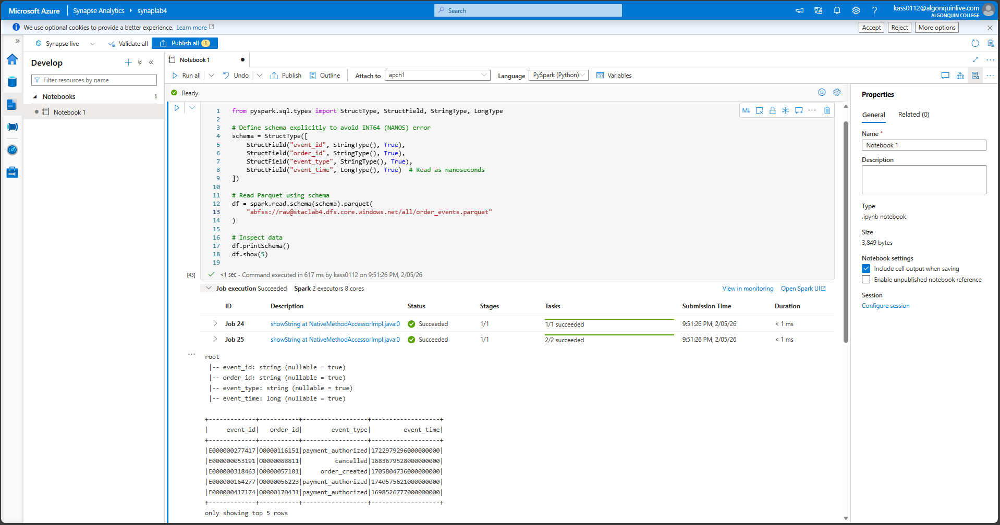

## PART 2: Data Transformation using Spark 
### Step 4: 
1.	Remove Duplicates : Remove duplicate records:
df_dedup = df.dropDuplicates()
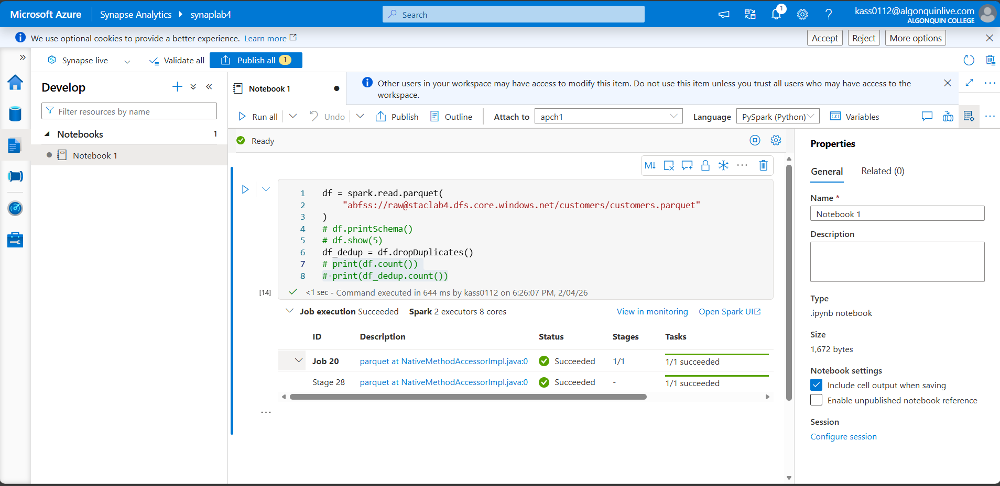
2.	Verify record count:
print(df.count())
print(df_dedup.count())
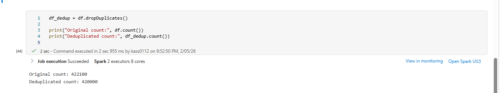

## Step 5: Fix Data Types 

1.	Convert timestamp columns to proper datetime format:

from pyspark.sql.functions import to_timestamp
df_clean = df_dedup.withColumn(  "event_time",  to_timestamp("event_time"))
2.	Verify schema:
df_clean.printSchema()
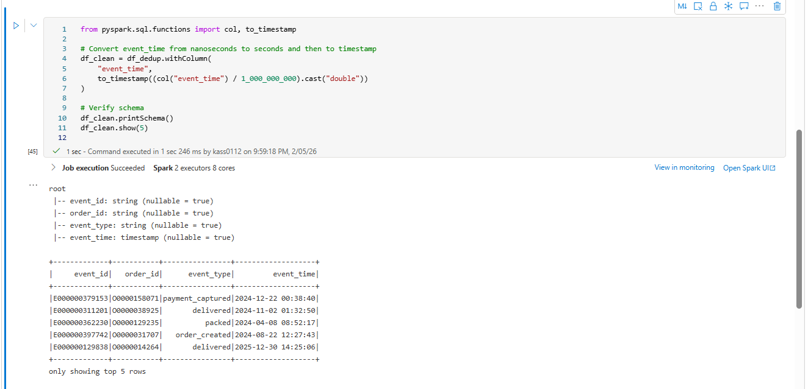

### Step 6: Create Derived Columns 

1.	Add Year and Month columns:
from pyspark.sql.functions import year, month
df_transformed = (
    df_clean
    .withColumn("Year", year("event_time"))
    .withColumn("Month", month("event_time"))
)

2.	Preview results:
df_transformed.show(5)
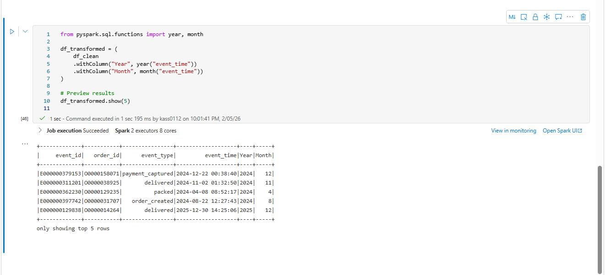

### Step 7: Write Transformed Data to Refined Zone
1.	Create a new container named: refined
2.	Write transformed data:
df_transformed.write.mode("overwrite").parquet( "abfss://refined@<storage-account>.dfs.core.windows.net/")
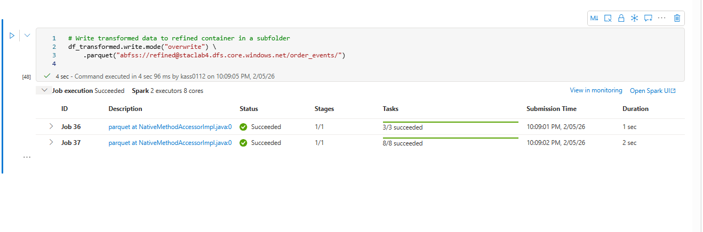
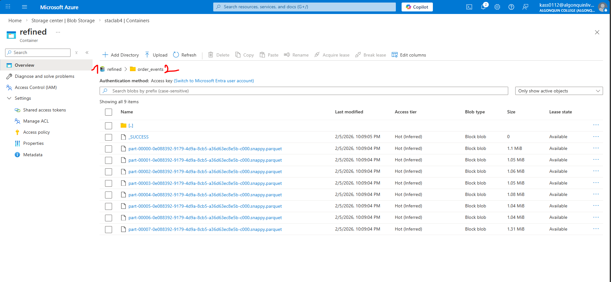

## PART 3: Load & Analyze Data

### Step 8: Create External Table using SQL 
1.	Open Synapse SQL Script
2.	Create an external table over refined data:
**NOTE:** From my research I found taht there is no need to CREATE EXTERNAL DATA SOURCE or CREATE EXTERNAL TABLE. I can query the Parquet files directly with OPENROWSET
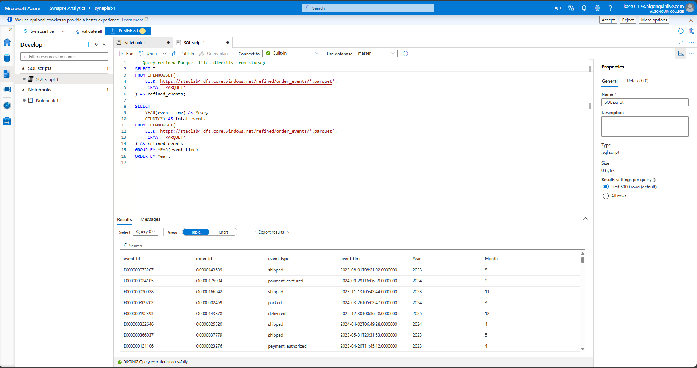

### Step 9: Analyze & Visualize Data 

1.	Notebook Visualization
df_transformed.groupBy("Year").count().show()
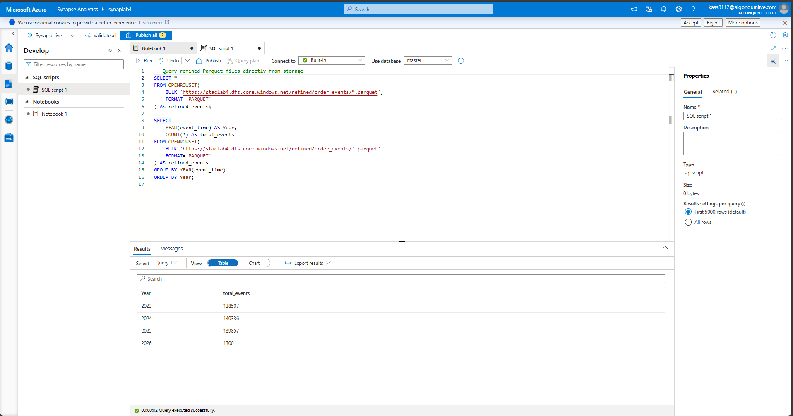

Step 10: Clean all the resources created during this lab.
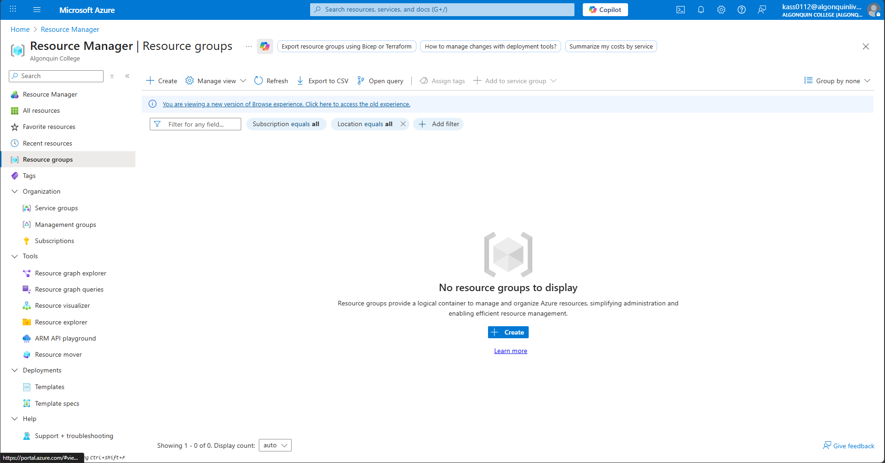

