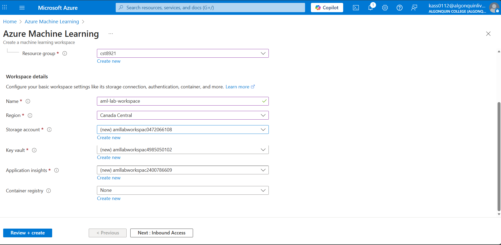
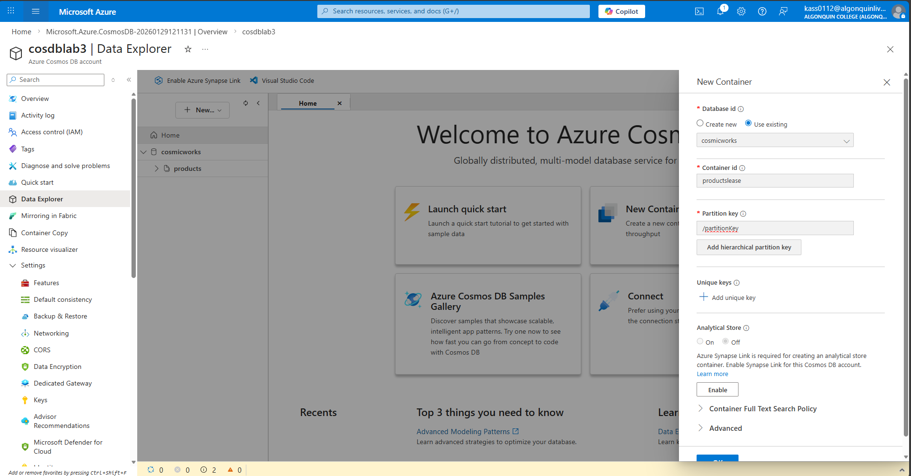
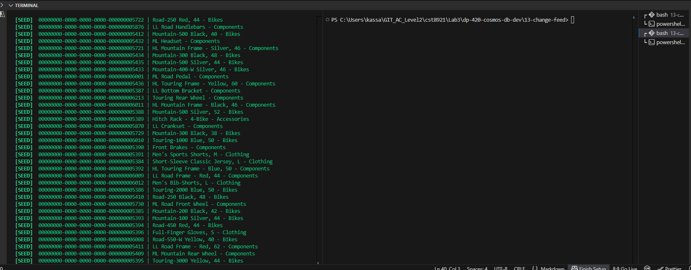
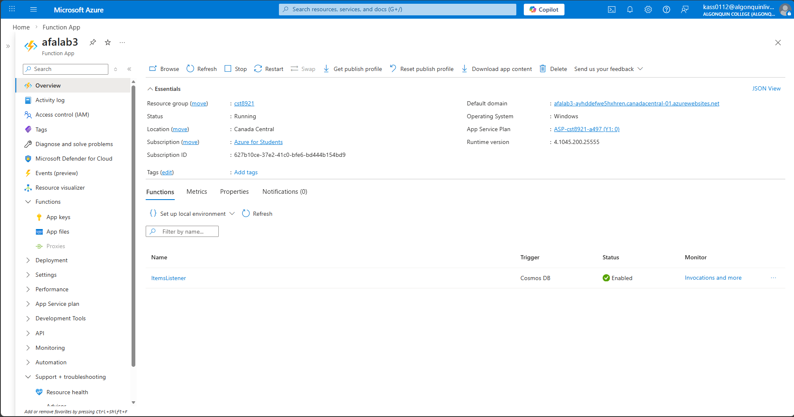
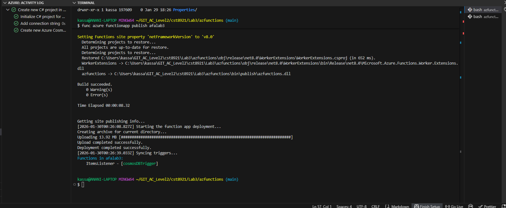
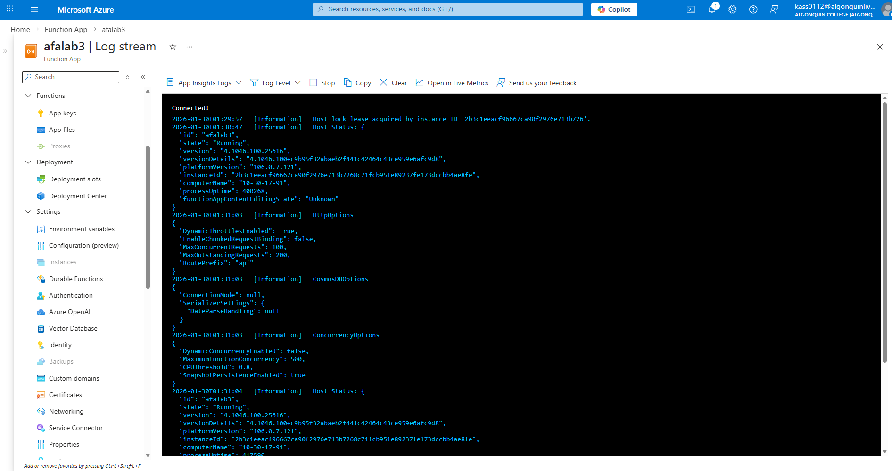

# About me 
### Full name: Anani Thierry Kassa
### Student ID: 041140713

### Task 1

1.	Start Visual Studio Code.
2.	Open the command palette and run Git: Clone to clone the https://github.com/microsoftlearning/dp-420-cosmos-db-dev GitHub repository in a local folder of your choice.
3.	Once the repository has been cloned, open the local folder you selected in Visual Studio Code.
4.	Create an azure cosmos db for nosql account. Choose capacity mode as serverless.

5.	Review keys pane in cosmosdb account and notice the connection details and credentials to connect the account from sdk.
6.	In data explorer, expand new container and select new database.
7.	In new database popup, enter “cosmicworks” value in database id.
8.	In data explorer pane, select new container and enter following values:

9.	Create another container with the following values:

...
24.	Seed your Azure Cosmos DB for NoSQL account with sample data

25.	You will use a command-line utility that creates a cosmicworks database and a products container. The tool will then create a set of items that you will observe using the change feed processor running in your terminal window.
26.	In Visual Studio Code, open the Terminal menu and then select Split Terminal to open a new terminal side by side with your existing instance.
27.	Install the cosmicworks command-line tool for global use on your machine.

dotnet tool install cosmicworks --global --version 1.*
28.	Run cosmicworks to seed your Azure Cosmos DB account with the following command-line options:

cosmicworks --endpoint <cosmos-endpoint> --key <cosmos-key> --datasets product

29.	Wait for the cosmicworks command to finish populating the account with a database, container, and items.

30.	Observe the terminal output from your .NET application. The terminal outputs a Detected Operation message for each change that was sent to it using the change feed.

31.	Close both integrated terminals.

32.	Verify the changes in product and productlease containers.

33.	Close Visual Studio Code.

### Task 2: Create an Azure Function app and Azure Cosmos DB-triggered function

1.	Create an Azure Cosmos DB for NoSQL account. Use the cosmos db account created in the previous steps.
2.	Create a function app in azure using the following configurations:

3.	Wait for the deployment task to complete before continuing with this task.
4.	Go to the newly created Azure Functions account resource and navigate to the Functions pane.
5.	In the Functions pane, select + Create.
6.	In the Create function popup, create a new function with the following settings, leaving all remaining settings to their default values:
7.	Implement function code in .net

8.	In the ItemsListener | Function pane, navigate to the Code + Test pane.
9.	In the editor for the run.csx script, delete the contents of the editor area.
10.	 Use the following code 
11.	Expand the Logs section to connect to the streaming logs for the current function.
12.	Save the current function code.
13.	Observe the result of the C# code compilation. You should expect to see a Compilation succeeded message at the end of the log output.

14.	Maximize the log section to expand the output window to fill the maximum available space.
15.	You will use another tool to generate items in your Azure Cosmos DB for NoSQL container. Once you generate the items, you will return to this browser window to observe the output. Do not close the browser window prematurely.

16.	Seed your Azure Cosmos DB for NoSQL account with sample data
17.	You will use a command-line utility that creates a cosmicworks database and a products container. The tool will then create a set of items that you will observe using the change feed processor running in your terminal window.
18.	Start Visual Studio Code.
19.	In Visual Studio Code, open the Terminal menu and then select New Terminal to open a new terminal instance.
20.	Install the [cosmicworks][nuget.org/packages/cosmicworks] command-line tool for global use on your machine.
21.	Run cosmicworks to seed your Azure Cosmos DB account with the following command-line options:
22.	Wait for the cosmicworks command to finish populating the account with a database, container, and items.

23.	Close the integrated terminal.

24.	Close Visual Studio Code.

25.	Return to the currently open browser window or tab with the Azure Functions log section expanded.

26.	Observe the log output from your function. The terminal outputs a Detected Operation message for each change that was sent to it using the change feed. The operations are batched into groups of ~100 operations.

27.	Close your web browser window or tab.

28.	Delete all the resources after completing the lab and document all the steps in the lab report with the screenshots.
