# About me 
### Full name: Anani Thierry Kassa
### Student ID: 041140713

### Step A1 - Create Storage Account
1.	Azure Portal → Create a resource
2.	Search Storage account
3.	Configure:
o	Subscription: your subscription
o	Resource group: rg-serverless-lab
o	Storage account name: unique lowercase name
o	Region: same as Function (e.g., East US)
o	Performance: Standard
o	Redundancy: LRS
4.	Click Review + Create → Create
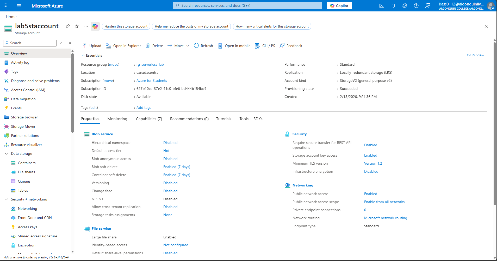

### Step A2 - Create Blob Container
1.	Open the storage account
2.	Select Containers
3.	Click + Container
o	Name: raw-data
o	Public access level: Private
4.	Click Create
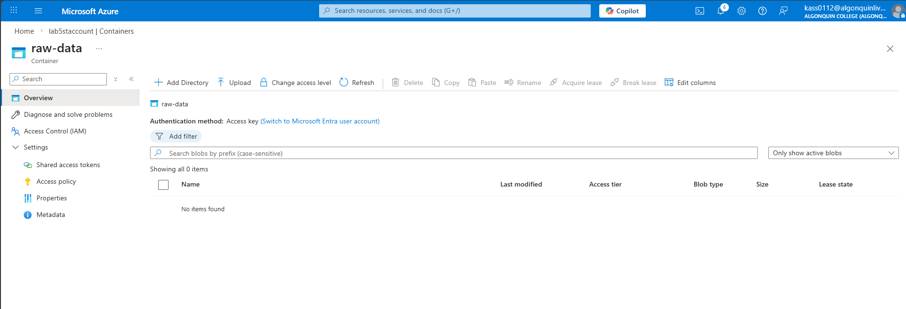

### Step B1 - Create Function App
1.	Azure Portal → Create a resource
2.	Search Function App
3.	Configure:
o	Publish: Code
o	Runtime stack: Python
o	Version: Python 3.10+
o	Region: same as storage
o	Plan: Consumption (Serverless)
4.	Enable Application Insights
5.	Click Create
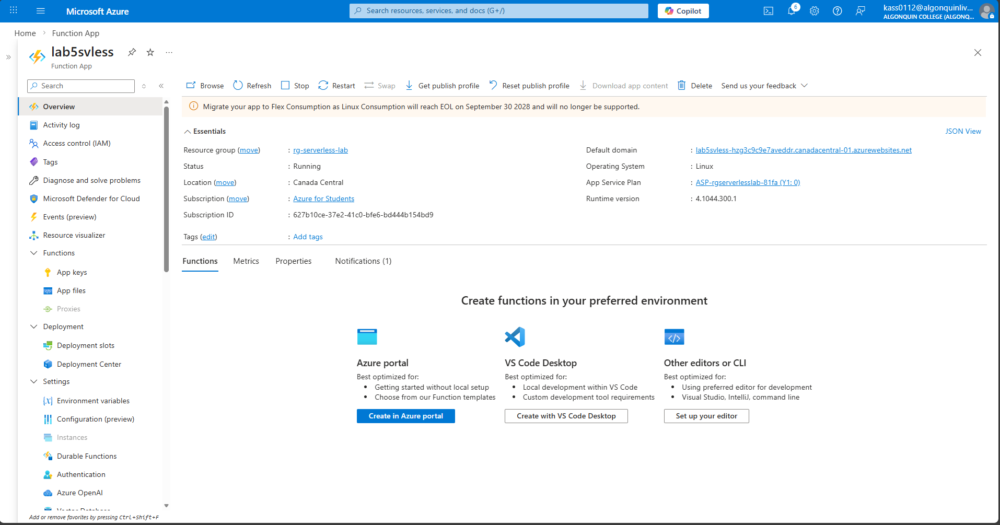

### Step B2 - Create Function
1.	Open the Function App
2.	Select Functions → Create
3.	Choose:
o	Development environment: Portal
o	Template: Event Grid trigger
4.	Function name: ProcessBlobUpload
5.	Click Create
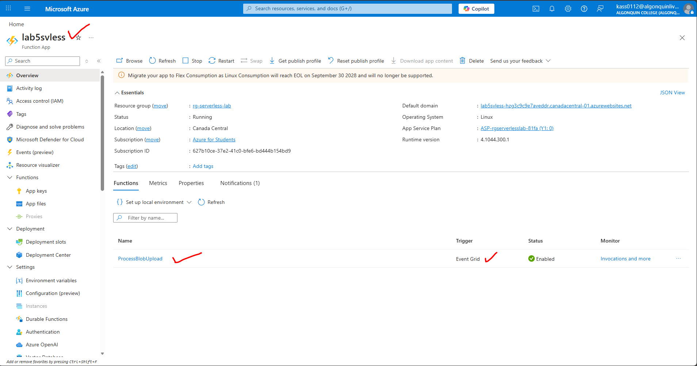

### Step C1 - Create Event Subscription
1.	Open the Storage Account
2.	Select Events
3.	Click + Event Subscription
4.	Configure:
o	Name: blob-created-sub
o	Event schema: Event Grid Schema
o	Event types: Blob Created
o	Endpoint type: Azure Function
o	Endpoint:
    	Subscription
    	Resource Group
    	Function App
    	Function: ProcessBlobUpload
5.	Click Create
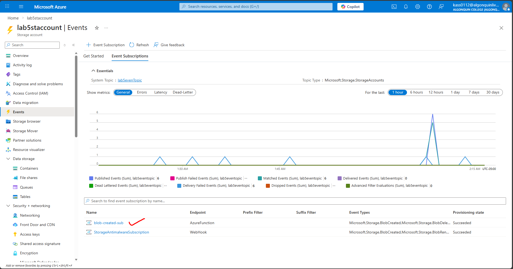

### Step D1-  Update Function Code
Open the function → Code + Test 
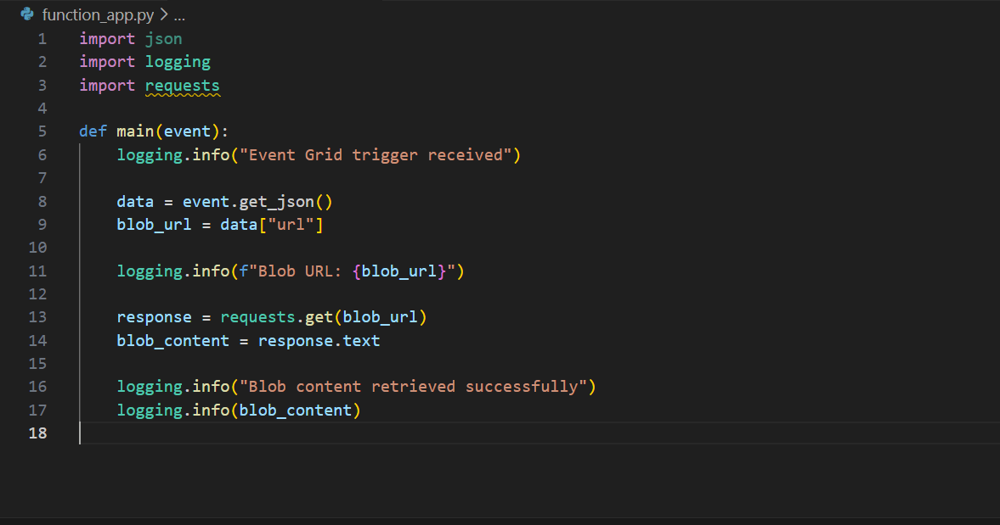

### Step D2 - Verify Function Settings
1.	Go to Configuration
2.	Confirm:
o	AzureWebJobsStorage exists
o	Application Insights is enabled
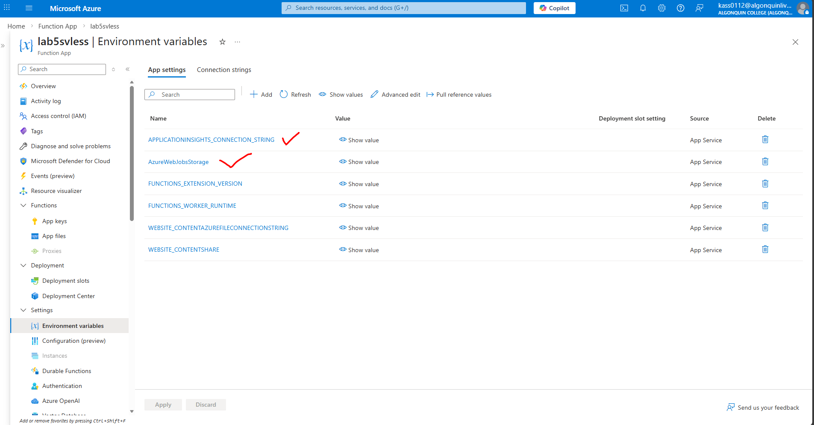

## Part E - Upload Test Data to Blob Storage
### Step E1 - Create Sample Data File
Create a local file named wind_data.json
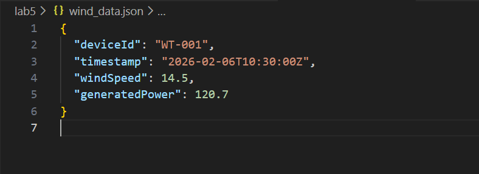

# Step E2 - Upload File
1.	Azure Portal → Storage Account → Containers
2.	Open raw-data
3.	Click Upload
4.	Select wind_data.json
5.	Click Upload

# Part F - Verify End-to-End Execution
### Step F1 - Confirm Function Invocation
1.	Open Function App
2.	Select Functions → ProcessBlobUpload
3.	Select Monitor
4.	Click Refresh
You should see successful invocations.
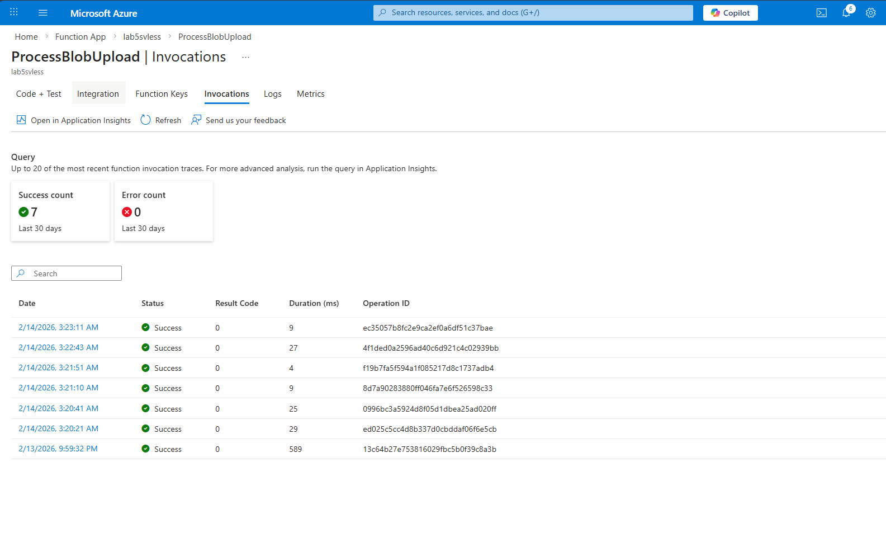

### Step F2 - View Logs (Blob Content)
1.	Inside Monitor, open an invocation
2.	Confirm logs show:
o	Blob URL
o	JSON file content
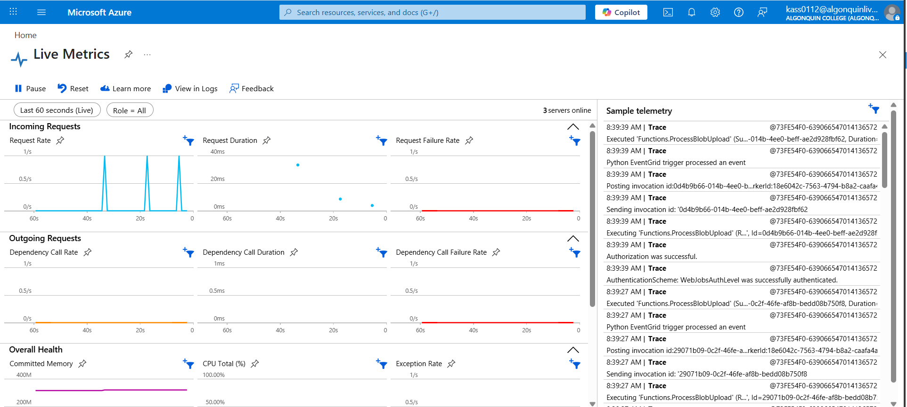
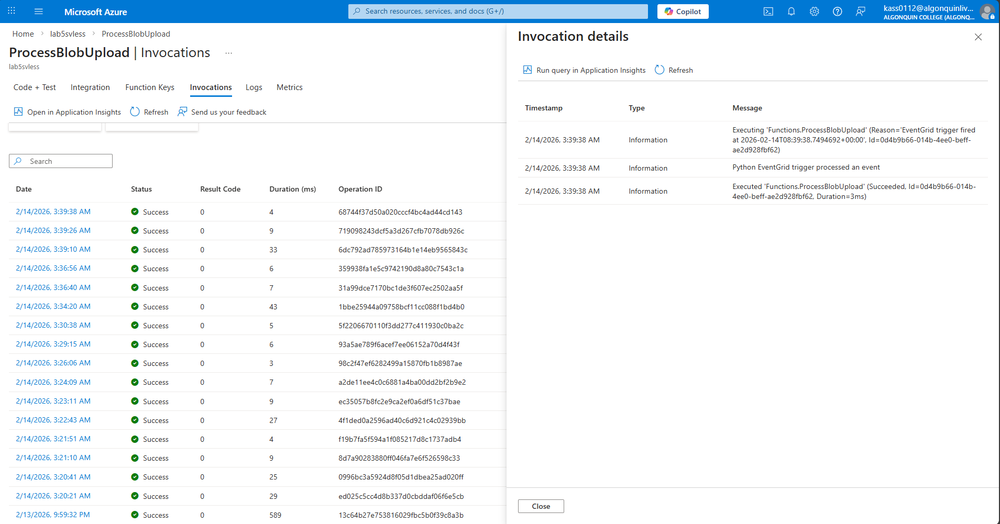

## Part G - Cleanup (Mandatory)
To avoid charges:
1.	Azure Portal → Resource groups
2.	Select rg-serverless-lab
3.	Click Delete resource group
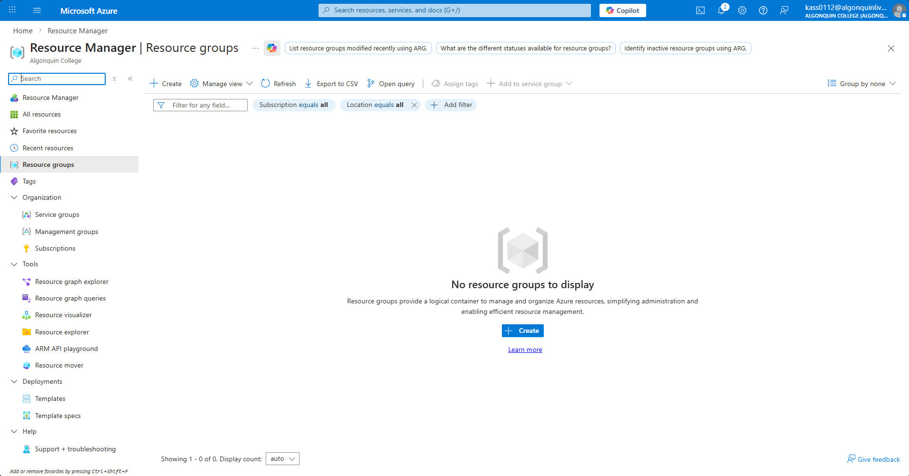